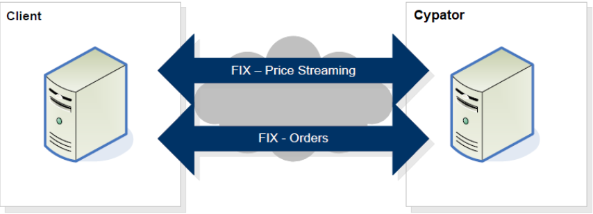

# Introduction

## FIX Introduction

This document details the Financial Information eXchange (FIX) protocol used by the Cypator Crypto trading ECN. Cypator uses the FIX protocol to stream (Taker API), retrieve (Maker API) prices, and handle orders for FX Spot with a counterparty, referred to generically in this document as the “Client”.
To communicate with the ECN via the FIX protocol, there must be IP connectivity between Cypator and the Client, and the Client must initiate the connection. The Client must support the FIX 4.4 or FIX 4.2 protocol to communicate properly with the ECN.
The diagram below presents a high-level overview of the FIX-based FX electronic dealing
architecture.
<br />
Cypator  provides two FIX sessions for interaction with Clients. The first session is specifically for price communication and the second is for trading. Clients need to ensure that the appropriate session is used when messages are sent to the ECN.
<br />
This document defines the Capacitor FIX API for sending out market prices, receiving orders  and providing trading execution notifications via the Cypator FIX gateway

* The FIX gateway is accessible with an OpenVPN connection.
* There are two interfaces: FIX Market data (price) and FIX Trading (orders).
* FIX Trading and Fix Market data require a valid SenderCompId, login, and password specified in the Logon message.
* The protocol is based on FIX protocol 4.4 [FIX protocol 4.4](http://www.fixtradingcommunity.org/). Refer to FIX 4.4 documentation if there is no tag information specified.
* FIX 4.2 is also supported, but is more limited and less recommended
* The FIX gateway supports a subset of messages and tags listed in this document.
* Price is represented in natural value (e.g. 25000.01 for BTC/USD).




## FIX Connectivity

* The following are the ways a client can connect to the API:
  * Internet over VPN
* VPN connectivity is routed to the nearest geographical instance - New York, London, or Singapore.
* Access to the platform has to go through SSL encrypted TCP connection over the Internet. If needed, Cypator can provide all necessary keys and certifications.    
* Only one market and trade connection per client is supported.


## FIX Session Time
* The session will be up the full week with a 3-minute scheduled restart on a weekly basis every Sunday. The exact time for restart will be scheduled with the client.
  * StartDay=Sunday
  * EndDay=Sunday
  * StartTime=07:03:00
  * EndTime=07:00:00


## FIX Sessions

* The Cypator trading interface supports the two types of orders
  * Limit
  * Market
* The Cypator trading interface supports the following Time in force (TIF):
  * IOC - Immediate or Cancel
  * FOK - Fill or kill
  * Market - Best attempt at market price


<aside class="warning">The Cypator trading interface currently does not support resting orders.</aside>

## FIX Post Trade

For clients or partners requiring a post-trade message (support only for Taker API), and that can code to the Cypator FIX API the following Trade Capture Report (AE) message will be sent.
In addition, in the event of a communication breakdown, the client can send a “Request Trade Capture Report” message and include in it all the Order IDs for which they want to verify if a trade was created or not.


## FIX Messages, Products and Support
* The API supports the following:
  * FIX version 4.4 (recommended) and 4.2
  * Single session or Dual session.
  * Product type - Spot trading only.
  * Assets - any crypto coin and FIAT currency are supported. Limitations on what Assets are allowed are defined in the application and business agreement.
  * For FIX 4.2 and FIX 4.4 dual sessions - if we receive a message on the wrong session- it will be rejected. In addition, FIX 4.2 doesn’t support all message types.

| Message type                          | Fix Version Supported | Market Session   | Trading Session | 
| ------------------------------------- | --------------------- | ---------------- |-----------------|
| Heartbeat <0>                         | 4.2/4.4               | Y                | Y               |
| Test Request <1>                      | 4.2/4.4               | Y                | Y               |
| Resend Request <2>                    | 4.2/4.4               | Y                | Y               |
| Reject <3>                            | 4.2/4.4               | Y                | Y               |
| Sequence Reset <4>                    | 4.2/4.4               | Y                | Y               |
| Logout <5>                            | 4.2/4.4               | Y                | Y               |
| Logon <A>                             | 4.2/4.4               | Y                | Y               |
| Market Data Request <V>               | 4.2/4.4               | Y                | N               |
| Market Data Request Reject <Y>        | 4.2/4.4               | Y                | N               |
| Market Data-Snapshot/Full Refresh <W> | 4.2/4.4               | Y                | N               |
| New Order Single <D>                  | 4.2/4.4               | N                | Y               |
| Execution Report <8>                  | 4.2/4.4               | N                | Y               |
| Trade Capture Report <AE>             | 4.4                   | N                | Y               |
| Trade Capture Report Request <AD>     | 4.4                   | N                | Y               |
| Trade Capture Report Request Ack <AQ> | 4.4                   | N                | Y               |

## FIX Duplicate check
There is always a possibility of duplicate trade being sent out, for example after a network disconnect. The client is expected to be able to identify duplicate trades and reject them, by using the tag 37 - OrderID.

## FIX Header and Trailer
The following defines the FIX messages standard header and trailer.

Header

| Tag | Name           | Mandatory    | 
|-----|----------------|--------------|
| 8   | BeginString    | Y            |
| 9   | BodyLength     | Y            |
| 34  | MsgSeqNum      | Y            |
| 35  | MsgType        | Y            |
| 49  | SenderCompID   | Y            |
| 50  | SenderSubID    | Y            |
| 52  | SendingTime    | Y            |
| 56  | TargetCompID   | Y            |

Trailer

| Tag | Name      | Mandatory    | 
|-----|-----------|--------------|
| 10  | CheckSum  | Y            |


## Websocket API Connectivity

* Only one market and trade connection per client supported, on new connection previous connection will be dropped.
* When the trade session goes down market data feed will not be consumed (Maker API) even if the market session is connected. Market data snapshot consumption will resume after the trade session is reconnected.

## Websocket API Sign generation for authentication
Use HMAC SHA256 method to hash the below string with a password and then perform Base64 encoding
String to be encrypted = timestamp + "/verify"
Timestamp needs to be within the current times 30-second range.

> Java Example

```java 

  String stringToHashAndEncode = timeStamp + "/verify";
  Mac sha256HMAC = Mac.getInstance("HmacSHA256");

  SecretKeySpec secretKeySpec = new SecretKeySpec(passPhrase.getBytes(), "HmacSHA256");
  sha256HMAC.init(secretKeySpec);
  String hash = Base64.getEncoder().encodeToString(sha256HMAC.doFinal(stringToHashAndEncode.getBytes()));
```

> Python Example

```python 

  import hashlib
  import hmac
  import base64
  
  string_to_hash_and_encode = timeStamp + "/verify"
  hash_obj = hmac.new(secret_key, message, hashlib.sha256)
  hash_value = base64.b64encode(hash_obj.digest()).decode("utf-8")
```


# FIX Taker API 


## Logon

> FIX 4.4 Client -> Cypator


This message is sent to initiate a FIX session and establishes the communication session, authenticates the connecting client, and initializes the message sequence number.

```plaintext 
8=FIX.4.4|9=79|35=A|49=cc11|56=cs1|34=1|52=20221031-07:40:55|98=0|108=20|553=User1|554=123456|10=034|
```

> FIX 4.4 Cypator -> Client

```plaintext 
8=FIX.4.4|9=62|35=A|34=1|49=cs1|52=20221031-07:40:55.074|56=cc11|98=0|108=20|10=039|
```


> FIX 4.2 Client -> Cypator

```plaintext 
8=FIX.4.2|9=58|35=A|49=cc21|56=cs1|34=1|52=20221031-07:41:49|98=0|108=20|10=102|
```

> FIX 4.2 Cypator -> Client

```plaintext 
8=FIX.4.2|9=62|35=A|34=1|49=cs1|52=20221031-07:41:50.005|56=cc21|98=0|108=20|10=028|
```

| Tag | Name            | Mandatory | Description                                                                        | 
|-----|-----------------|-----------|------------------------------------------------------------------------------------|
| 35  | MsgType         | Y         | A                                                                                  |
| 98  | EncryptMethod   | Y         | Y                                                                                  |
| 108 | HeartBtInt      | Y         | Y                                                                                  |
| 141 | ResetSeqNumFlag | N         | Indicated that both parties of the FIX Session should reset their sequence numbers |
| 553 | Username        | Y         | Available only in FIX 4.4                                                          |
| 554 | Password        | Y         | Available only in FIX 4.4                                                          |


## Heartbeat

This message is sent during periods of application inactivity to ensure connection validity. The receiving party should always respond with a heartbeat message.


| Tag | Name       | Mandatory | Description                                                                | 
|-----|------------|-----------|----------------------------------------------------------------------------|
| 35  | MsgType    | Y         | 0                                                                          |
| 98  | TestReqID  | N         | Required only when the heartbeat is in response to a Test Request Message  |


## Test Request

This message is used to verify connectivity and synchronize sequence numbers.  A test request should be responded to with a heartbeat from the recipient

| Tag | Name       | Mandatory | Description                                      | 
|-----|------------|-----------|--------------------------------------------------|
| 35  | MsgType    | Y         | 1                                                |
| 98  | TestReqID  |           | Identifier to be returned in Heartbeat response  |


## Logout

This message signals the normal termination of the trading session. A session terminated without a Logout message will be considered an abnormal condition.

| Tag | Name     | Mandatory | Description | 
|-----|----------|-----------|-------------|
| 35  | MsgType  | Y         | 5           |
| 55  | Text     | N         |             |


## Market Data Request

Once the logon process is complete, Market Data Requests can be sent to the ECN. Cypator will respond immediately with either a Market Data Full Refresh (35=W) message or a Market Data Request Reject message (35=Y).
Only a single product can be requested in each request. The client will receive both bid and ask prices in a single message.
The ECN also supports layers (also known elsewhere as price bands or tiers). Quotes containing bid prices and quantities for all layers are always streamed in the same message, as is the case for quotes containing ask prices and quantities.

This message is used to subscribe/unsubscribe to market data rate information.

> FIX 4.4 Client -> Cypator subscribe

```plaintext 

8=FIX.4.4|9=99|35=V|49=cc12|56=cs1|34=8|52=20221031-07:43:44|262=1|263=1|264=0|146=1|55=BTC/USD|267=2|269=0|269=1|10=095|
```

> FIX 4.2 Client -> Cypator subscribe

```plaintext 

8=FIX.4.2|9=99|35=V|49=cc22|56=cs1|34=3|52=20221031-08:34:43|262=1|263=1|264=0|146=1|55=BTC/USD|267=2|269=0|269=1|10=089|
```


> FIX 4.4 Client -> Cypator Unsubscribe

```plaintext 

8=FIX.4.4|9=99|35=V|49=cc12|56=cs1|34=7|52=20221031-08:35:17|262=1|263=2|264=0|146=1|55=BTC/USD|267=2|269=0|269=1|10=097|
```

> FIX 4.4 Client -> Cypator Unsubscribe

```plaintext 

8=FIX.4.2|9=99|35=V|49=cc22|56=cs1|34=5|52=20221031-08:34:55|262=1|263=2|264=0|146=1|55=BTC/USD|267=2|269=0|269=1|10=095|
```


| Tag         | Name                    | Mandatory | Description                                                                                                                                                                                | 
|-------------|-------------------------|-----------|--------------------------------------------------------------------------------------------------------------------------------------------------------------------------------------------|
| 35          | MsgType                 | Y         | V                                                                                                                                                                                          |
| 262         | MDReqID                 | Y         | Unique Market Data Request ID.  This will be used in responses by Cypator or by the client to cancel a request. To unsubscribe from market data, the same ID must be sent with tag 263 = 2 |
| 263         | SubscriptionRequestType | Y         | 1 – Snapshot + Updates (Subscribe) <br />  2 – Disable Snapshot + Updates (Unsubscribe)                                                                                                    |
| 264         | MarketDepth             | Y         | 0 - Full Book  <br /> 1 - Top of the Book                                                                                                                                                  |
| 265         | MDUpdateType            | N         | 0 - Full refresh                                                                                                                                                                           | 
| 266         | AggregatedBook          | N         | Y - VWAP book <br /> N - Raw prices may or may not include the liquidity provider names.                                                                                                   |
| 267         | NoMDEntryTypes          | Y         | Number of MDEntryType fields being requested. 2 - bid and offer <br /> Note – please make sure to request in tag 269 both Bid and Offer. Request for a single side will be rejected!!!     |
| -><br />269 | MDEntryType             | Y         | Market Data entries types list: <br /> 0 - Bid <br /> 1 - Offer <br /> Repeated field: 269=0, 269=1                                                                                        |
| 146         | NoRelatedSym            | Y         | 1 ( we allow only a single asset per subscription)                                                                                                                                         |
| -><br />55  | Symbol                  | Y         | Asset - “BTC/USD”                                                                                                                                                                          |
| -><br />64  | FutSettDate             | N         | Value date YYYYMMDD. Currently unused, will be used once forward is supported.                                                                                                             |


## Market Data Request Reject

> FIX 4.4 Cypator -> Client

```plaintext 

8=FIX.4.4|9=85|35=Y|34=106|49=cs1|52=20221031-09:03:57.488|56=cc12|58=Duplicate MDReqID|262=1|281=1|10=094|
```

> FIX 4.2 Cypator -> Client

```plaintext 

8=FIX.4.2|9=84|35=Y|34=84|49=cs1|52=20221031-08:58:35.817|56=cc22|58=Duplicate MDReqID|262=1|281=1|10=050|
```


| Tag | Name            | Mandatory | Description                                                                                                                                        | 
|-----|-----------------|-----------|----------------------------------------------------------------------------------------------------------------------------------------------------|
| 35  | MsgType         | Y         | Y                                                                                                                                                  |
| 262 | MDReqID         | Y         | The  Unique ID of the received market data                                                                                                         |
| 281 | MDReqRejReason  | N         | Reason for rejection <br />  0 - Unknown Symbol <br /> 1 - Duplicate MDReqID <br /> 2 - Request not supported <br /> 3 - Insufficient Permissions  |


## Market Data Snapshot Full

> FIX 4.4 Cypator -> Client

```plaintext 

8=FIX.4.4|9=710|35=W|34=8|49=cs1|52=20221031-08:35:11.416|56=cc12|55=BTC/USD|262=1|268=20|269=0|270=202.15|271=0.00000001|269=0|270=202.16|271=0.00000002|269=0|270=202.17|271=0.00000003|269=0|270=202.18|271=0.00000004|269=0|270=202.19|271=0.00000005|269=0|270=202.2|271=0.00000006|269=0|270=202.21|271=0.00000007|269=0|270=202.22|271=0.00000008|269=0|270=202.23|271=0.00000009|269=0|270=202.24|271=0.0000001|269=1|270=202.35|271=0.00000001|269=1|270=202.36|271=0.00000002|269=1|270=202.37|271=0.00000003|269=1|270=202.38|271=0.00000004|269=1|270=202.39|271=0.00000005|269=1|270=202.4|271=0.00000006|269=1|270=202.41|271=0.00000007|269=1|270=202.42|271=0.00000008|269=1|270=202.43|271=0.00000009|269=1|270=202.44|271=0.0000001|10=073|
```

> FIX 4.2 Cypator -> Client

```plaintext 

8=FIX.4.2|9=710|35=W|34=3|49=cs1|52=20221031-08:34:44.164|56=cc22|55=BTC/USD|262=1|268=20|269=0|270=202.15|271=0.00000001|269=0|270=202.16|271=0.00000002|269=0|270=202.17|271=0.00000003|269=0|270=202.18|271=0.00000004|269=0|270=202.19|271=0.00000005|269=0|270=202.2|271=0.00000006|269=0|270=202.21|271=0.00000007|269=0|270=202.22|271=0.00000008|269=0|270=202.23|271=0.00000009|269=0|270=202.24|271=0.0000001|269=1|270=202.35|271=0.00000001|269=1|270=202.36|271=0.00000002|269=1|270=202.37|271=0.00000003|269=1|270=202.38|271=0.00000004|269=1|270=202.39|271=0.00000005|269=1|270=202.4|271=0.00000006|269=1|270=202.41|271=0.00000007|269=1|270=202.42|271=0.00000008|269=1|270=202.43|271=0.00000009|269=1|270=202.44|271=0.0000001|10=072|
```

| Tag         | Name               | Mandatory | Description                                                                | 
|-------------|--------------------|-----------|----------------------------------------------------------------------------|
| 35          | MsgType            | Y         | W                                                                          |
| 262         | MDReqID            | Y         | The  Unique ID of the received market data request                         |
| 55          | Symbol             | Y         | e.g “BTC/USD”                                                              |
| 64          | FutSettDate        | N         | Value date YYYYMMDD. Required for forward. Will be supported in the future |
| 268         | NoMDEntries        | Y         | No. of market data updates in the message                                  |
| -><br />269 | MDEntryType        | Y         | ‘0’ (Bid) <br /> ‘1’ (Offer)                                               |
| -><br />270 | MDEntryPx          | Y         | Price of entry                                                             |
| -><br />271 | MDEntrySize        | Y         | Quantity  of entry                                                         |
| -><br />282 | MDEntryOriginator  | N         | Liquidity provider name. In case of 266=N in Market Data Request Message.  |

In the event Cypator disables an instrument, it will send a message to the Taker side to clear its book for that instrument. This is done in order to prevent a reject or timeout for an order generated after the disable of the instrument.
The clear book message will be the standard 35=W message per instrument with 268=0.
An example of the message:

> FIX 4.4 Cypator -> Client

```plaintext 

8=FIX.4.4|9=100|35=W|34=268|49=cs1|52=20230619-09:45:58.883|56=cc12|55=ETH/USD|262=1|268=0|10=184| 
```

> FIX 4.2 Cypator -> Client

```plaintext 

8=FIX.4.2|9=100|35=W|34=268|49=cs1|52=20230619-09:45:58.883|56=cc12|55=ETH/USD|262=1|268=0|10=184| 
```


## New Order Single


A new order single message enables the client to send a request for a trade to the ECN.
Cypator requires that the ClOrdID <11> be unique.


> FIX 4.4  Client -> Cypator

```plaintext 

8=FIX.4.4|9=133|35=D|49=cc11|56=cs1|34=113|52=20221031-09:10:46|11=1598950759|21=1|55=BTC/USD|54=1|60=20221031-09:10:46|40=2|44=19123.20|38=100|59=4|10=003|
```

> FIX 4.2 Client -> Cypator

```plaintext 

8=FIX.4.2|9=133|35=D|49=cc21|56=cs1|34=113|52=20221031-09:11:04|11=1805964193|21=1|55=BTC/USD|54=1|60=20221031-09:11:04|40=2|44=19123.20|38=100|59=4|10=23
```

| Tag | Name                                             | Mandatory | Description                                                                                                                                                                                                                                                                                              | 
|-----|--------------------------------------------------|-----------|----------------------------------------------------------------------------------------------------------------------------------------------------------------------------------------------------------------------------------------------------------------------------------------------------------|
| 35  | MsgType                                          | Y         | D                                                                                                                                                                                                                                                                                                        |
| 11  | ClOrdID                                          | Y         | Client Order ID – must be unique                                                                                                                                                                                                                                                                         |
| 1   | Account                                          | N         | Client Account name                                                                                                                                                                                                                                                                                      |
| 60  | TransactTime                                     | Y         | The transaction timestamp of the orde                                                                                                                                                                                                                                                                    |
| 15  | Currency                                         | Y         | The currency or coin unit that represents the quantity                                                                                                                                                                                                                                                   |
| 54  | Side                                             | Y         | 1 (Buy) <br />  2 (Sell)                                                                                                                                                                                                                                                                                 |
| 55  | Symbol                                           | Y         | The Asset - Coin and currency combination, e.g EUR/USD, BTC/USD, ETH/BTC                                                                                                                                                                                                                                 |
| 38  | OrderQty                                         | Y         | The order quantity                                                                                                                                                                                                                                                                                       |
| 40  | OrdType                                          | Y         | 1 – Market <br />  2 – Limit <br /> 3 – Stop / Stop Los                                                                                                                                                                                                                                                  |
| 44  | Price                                            | Y         | Limit price if 40=2 <br /> Stop Price if 40 = 3 <br /> If 40=1 the price is required for pre trade credit check                                                                                                                                                                                          |
| 59  | TimeInForce                                      | N         | 1 – Good Till Cancel -not supported phase1 <br /> 3 – Immediate or Cancel (Default if no value provided) <br /> 4 – Fill or Kill <br /> 6 – Good Till Date  -not supported phase <br /> Note: OrdType=1 only supports TimeInForce=3 (IOC) OrdType=3 (Stop) only supports TimeInForce=1 (GTC) and 6 (GTD) |
| 64  | FutSettDate (FIX 4.2) <br /> SettlDate (FIX 4.4) | N         | Value date YYYYMMDD. Required for forward Will be supported in the future. Use FutSettDate if using FIX 4.2 Use SettlDate if using FIX 4.4                                                                                                                                                               |
| 126 | ExpireTime                                       | N         | Not supported in phase 1- Required for Good-Till-Date order request. Date and Time of the order expiration specified in YYYYMMDD-HH:MM:SS format. Expressed in GMT.                                                                                                                                      |


## Order Reject

This message is used by Cypator to reject an order message. This can happen if the order doesn’t comply with the FIX dictionary, naming issue or acceding throughput limitation

| Tag | Name                      | Mandatory | Description                                                                                                                                                                                                                                                                                                                                                                                                                                                                                                                                                                                                                                                                                                                                                                                                  | 
|-----|---------------------------|-----------|--------------------------------------------------------------------------------------------------------------------------------------------------------------------------------------------------------------------------------------------------------------------------------------------------------------------------------------------------------------------------------------------------------------------------------------------------------------------------------------------------------------------------------------------------------------------------------------------------------------------------------------------------------------------------------------------------------------------------------------------------------------------------------------------------------------|
| 35  | MsgType                   | Y         | 3                                                                                                                                                                                                                                                                                                                                                                                                                                                                                                                                                                                                                                                                                                                                                                                                            |
| 45  | RefSeqNum                 | Y         | Integer value -reference of the rejected order header sequence number MsgSeqNum <34>                                                                                                                                                                                                                                                                                                                                                                                                                                                                                                                                                                                                                                                                                                                         |
| 371 | RefTagID                  | N         | The tag number of the FIX field being referenced                                                                                                                                                                                                                                                                                                                                                                                                                                                                                                                                                                                                                                                                                                                                                             |
| 372 | RefMsgType                | N         | The message type (35) OF THE Fix message being referenced (e.g “D” for 35=D)                                                                                                                                                                                                                                                                                                                                                                                                                                                                                                                                                                                                                                                                                                                                 |
| 373 | SessionRejectReason       | N         | Code to identify reason for rejection: <br /> 0 = Invalid tag number <br /> 1 = Required tag missing <br /> 2 = Tag not defined for this message type <br /> 3 = Undefined Tag <br />4 = Tag specified without a value<br />5 = Value is incorrect (out of range) for this tag<br />6 = Incorrect data format for value<br />7 = Decryption problem<br />8 = Signature <89> problem<br />9 = CompID problem<br />10 = SendingTime <52> accuracy problem<br />11 = Invalid MsgType <35><br />12 = XML Validation error<br />13 = Tag appears more than once<br />14 = Tag specified out of required order<br />15 = Repeating group fields out of order<br />16 = Incorrect NumInGroup count for repeating group<br />17 = Non "Data" value includes field delimiter (<SOH> character)<br />99 = Other<br />  |
| 58  | Text                      | N         | Error message text                                                                                                                                                                                                                                                                                                                                                                                                                                                                                                                                                                                                                                                                                                                                                                                                             |


## Order Cancel Request

This message is used by the client to cancel any live order they may have. Applicable for orders of type GTC/GTD/GIS
<aside class="warning"> Not supported in phase 1</aside>


| Tag | Name          | Mandatory | Description                                                               | 
|-----|---------------|-----------|---------------------------------------------------------------------------|
| 35  | MsgType       | Y         | F                                                                         |
| 1   | Account       | N         | Client Account name                                                       |
| 11  | ClOrderID     | Y         | Client Order ID                                                           |
| 37  | OrderID       | Y         | The order ID of the order to be canceled                                  |
| 41  | OrigClOrdID   | Y         | Client Order ID of Order being replaced                                   |
| 55  | Symbol        | N         | The Asset - Coin and currency combination, e.g. EUR/USD, BTC/USD, ETH/BTC |
| 60  | TransactTime  | N         | The transaction timestamp of the order cancel request                     |


## Cancel Rejected

This message is used by Cypator to reject a cancel order message. This can happen if the order is already filled or is in the process of getting filled.
<aside class="warning"> Not supported in phase 1</aside>


| Tag | Name             | Mandatory | Description                                                               | 
|-----|------------------|-----------|---------------------------------------------------------------------------|
| 35  | MsgType          | Y         | 9                                                                         |
| 11  | ClOrderID        | Y         | Client Order ID                                                           |
| 37  | OrderID          | Y         | The order ID of the order to be canceled                                  |
| 39  | OrderStatus      | Y         | Status of the order cancel request (not of any order)                     |
| 41  | OrigClOrdID      | Y         | Client Order ID of Order being replaced                                   |
| 55  | Symbol           | N         | The Asset - Coin and currency combination, e.g. EUR/USD, BTC/USD, ETH/BTC |
| 434 | CxlRejResponseTo | Y         | 1 – Order Cancel Request <br />2 – Order Cancel/Replace Request           |
| 102 | CxlRejReason     | N         | Error Code                                                                |
| 58  | Text             | N         | Error message                                                             |
| 60  | TransactTime     | Y         | The transaction timestamp of the order cancel request                     |


## Execution Report

This message is used to communicate Order Ack, Order Reject, Order Fill and Order Status Responses.

* There are Four possible 35=8 responses to an order
  * Ack - 150 =0
  * NACK - 150=8
  * Fill - partial - 150 =2/F, 39=1
  * Fill - full - 150 =2/F, 39=2

For a FOK type order there are two possible responses – as an example if the order is for 5  BTC/USD

### Scenario 1 – FOK – order is not filled - CANCEL


| Sequence                    | Message                                                                  |  
|-----------------------------|--------------------------------------------------------------------------|
| Cancel message is provided  | Execution report (35=8) <br /> ExecType (150=4) <br />  OrdStatus (39=4) |


### Scenario 2 – FOK – order is fully filled - DONE

| Sequence                                 | Message                                                                    |  
|------------------------------------------|----------------------------------------------------------------------------|
| Full Fill message is provided for 5 BTC  | Execution report (35=8) <br /> ExecType (150=2/F) <br />  OrdStatus (39=2) |


For an IOC type order there are two additional possible responses in addition to the ones above which may happen in the case of multiple partial fills. We use the OrdStatus tag to indicate if the order is partial or fully complete – as an example if the order is for 5  BTCUSD

### Scenario1 – IOC – order is fully filled - DONE

| Sequence                                                      | Message                                                                    |  
|---------------------------------------------------------------|----------------------------------------------------------------------------|
| Fill message for 2 BTC is provided                            | Execution report (35=8) <br /> ExecType (150=2/F) <br />  OrdStatus (39=1) |
| Cancel remaining message is provided for the remaining 3 BTC  | Execution report (35=8) <br /> ExecType (150=4) <br />  OrdStatus (39=1)   |


> FIX 4.4  Cypator -> Client Ack

```plaintext 

8=FIX.4.4|9=197|35=8|34=112|49=cs1|52=20221031-09:10:46.686|56=cc11|11=1598950759|14=0|15=BTC|17=1598950759|32=0|37=A010tlPyxyg|39=0|41=1598950759|44=19123.2|54=1|55=BTC/USD|60=20221031-11:10:46.686|150=0|151=100|10=012|
```


> FIX 4.2  Cypator -> Client Ack

```plaintext 

8=FIX.4.2|9=197|35=8|34=113|49=cs1|52=20221031-09:11:04.479|56=cc21|11=1805964193|14=0|15=BTC|17=1805964193|20=0|32=0|37=A010tlPyxyh|39=0|41=1805964193|44=19123.2|54=1|55=BTC/USD|60=20221031-11:11:04.479|150=0|151=100|10=223|
```

> FIX 4.4  Cypator -> Client

```plaintext 

8=FIX.4.4|9=228|35=8|34=113|49=cs1|52=20221031-09:10:46.706|56=cc11|6=19123.2|11=1598950759|14=100|15=BTC|17=VuzGNOBG|31=19123.2|32=100|37=A010tlPyxyg|38=100|39=2|41=1598950759|44=19123.2|54=1|55=BTC/USD|60=20221031-11:10:46.706|64=202210304|150=F|151=0|10=153|
```

> FIX 4.2  Cypator -> Client

```plaintext 

8=FIX.4.2|9=228|35=8|34=114|49=cs1|52=20221031-09:11:04.480|56=cc21|6=19123.2|11=1805964193|14=100|15=BTC|17=CAfoHyfD|20=2|31=19123.2|32=100|37=A010tlPyxyh|38=100|39=2|41=1805964193|44=19123.2|54=1|55=BTC/USD|60=20221031-11:11:04.480|64=202210304|150=2|151=0|10=136|
```

| Tag | Name                                                | Mandatory                     | Description                                                                                                                                                                                                           | 
|-----|-----------------------------------------------------|-------------------------------|-----------------------------------------------------------------------------------------------------------------------------------------------------------------------------------------------------------------------|
| 35  | MsgType                                             | Y                             | 8                                                                                                                                                                                                                     |
| 1   | Account                                             | N                             | Client Account Name                                                                                                                                                                                                   |
| 11  | ClOrdID                                             | Y                             | Client Order ID                                                                                                                                                                                                       |
| 37  | OrderID                                             | Y                             | Cypator unique order ID for the Trade                                                                                                                                                                                 |
| 41  | OrigClOrdID                                         | N                             | Required for response to Order Cancel or Order Replace                                                                                                                                                                |
| 17  | ExecID                                              | Y                             | Cypator Execution ID. Unique ID in each execution report                                                                                                                                                              |
| 20  | ExecTransType                                       | Y - FIX 4.2 <br /> N- FIX 4.4 | Only applicable to Fix 4.2 <br /> 0= New <br /> 1 = Cancel <br /> 2 = Correct                                                                                                                                         |
| 150 | ExecType                                            | Y                             | FIX 4.2 <br /> 0 = New <br /> 1 = Partially Fill <br /> 2 = Fill <br /> 4 = Canceled <br /> 8 = Rejected <br /> FIX 4.4 <br /> 0 = New <br /> F = Trade (partial fill or fill)<br /> 4 = Canceled <br /> 8 = Rejected |
| 39  | OrdStatus                                           | Y                             | 0 = New <br /> 1 = Partially Fill <br /> 2 = Fill <br /> 4 = Canceled <br /> 8 = Rejected                                                                                                                             |
| 64  | FutSettDate                                         | N                             | Settlement date for order fills if exists.  In YYYYMMDD format                                                                                                                                                        |
| 15  | Currency                                            | Y                             | The currency or coin unit that represents the quantity                                                                                                                                                                |
| 54  | Side                                                | Y                             | 1 (Buy) <br /> 2 (Sell)                                                                                                                                                                                               |
| 55  | Symbol                                              | Y                             | The Asset - Coin and currency combination, e.g. EUR/USD, BTC/USD, ETH/BTC                                                                                                                                             |
| 38  | OrderQty                                            | N                             | Order quantity specified by the Client. Not present in Order Reject                                                                                                                                                   |
| 14  | CumQty                                              | Y                             | The amount that has been filled so far                                                                                                                                                                                |
| 6   | AvgPx                                               | N                             | Average price of all fills on for the order                                                                                                                                                                           |
| 31  | LastPx                                              | N                             | Trade price.                                                                                                                                                                                                          |
| 32  | LastQty (For Fix4.4) <br /> LastShares (For Fix4.2) | Y                             | Amount bought or sold on this fill                                                                                                                                                                                    |
| 44  | Price                                               | Y                             | Order price                                                                                                                                                                                                           |
| 151 | LeavesQty                                           | Y                             | Quantity remaining of this order                                                                                                                                                                                      |
| 60  | TransactTime                                        | Y                             | The transaction timestamp of the order                                                                                                                                                                                |
| 103 | OrdRejReason                                        | N                             | Error code. Present in Order Reject                                                                                                                                                                                   |
| 58  | Text                                                | N                             | Error message. Present in Order Reject                                                                                                                                                                                |


<aside class="notice">
In the case where a Trade Acknowledgment and accompanying Trade Fill or Reject message are
not received within 5 seconds, from the time the trade request was sent, the Client MUST
contact Cyaptor using the following support email address: support@cypator.com. This support inbox is manned 24 hours a day 7 days a week, providing global support at all hours. Contact with Cypator should be made via an automated email alert from the Client’s trading system. However, in the event that the Client cannot support this, we would expect a manual email or a call to our
support desk.
</aside>


## Trade Capture Report

Used to report a trade between counterparties.

<aside class="success"> support only for FIX 4.4</aside>

> FIX 4.4  Cypator -> Client

```plaintext 

8=FIX.4.4|9=239|35=AE|34=2|49=cs1|52=20221031-09:43:02.535|56=cc11|17=s1|31=1234.56|32=0.00025|55=BTC/USD|60=20221030-10:10:28.629|75=20190824|150=F|487=0|568=HjdFFY13|571=A010tlPGF9S|748=1|912=Y|552=1|54=1|37=s3|11=123546|453=1|448=1|447=C|452=17|15=BTC|10=031
```

| Tag | Name                     | Mandatory | Description                                                                                                    | 
|-----|--------------------------|-----------|----------------------------------------------------------------------------------------------------------------|
| 35  | MsgType                  | Y         | AE                                                                                                             |
| 571 | TradeReportID            | Y         | ID for this message                                                                                            |
| 60  | TransactTime             | Y         | The transaction timestamp of the order UTC                                                                     |
| 487 | TradeReportTransType     | Y         | 0-New                                                                                                          |
| 75  | TradeDate                | Y         | Trade date in YYYYMMDD format. We use the creation date based on Transact time UTC                             |
| 568 | TradeRequestID           | N         | Request ID if the Trade Capture Report <AE> is in response to a Trade Capture Report Request <AD>              |
| 748 | TotNumTradeReports       | N         | Number of trade reports returned - if this report is part of a response to a Trade Capture Report Request <AD> |
| 912 | LastRptRequested         | N         | Indicates if this is the last report in the response to a Trade Capture Report Request <AD>                    |
| 150 | ExecType                 | N         | F - Trade                                                                                                      |
| 55  | Symbol                   | Y         | The Asset - Coin and currency combination, e.g. EUR/USD, BTC/USD, ETH/BTC                                      |
| 31  | LastPx                   | Y         | Price of the last fill. Only present in Fill report                                                            |
| 32  | LastQuantity             | Y         | Amount bought or sold on this fill                                                                             |
| 17  | ExecID                   | N         | Cypator Execution ID. Unique ID in each execution report                                                       |
| 552 | NoSides                  | Y         | Number of sides                                                                                                |
| 54  | -><br /> Side            | Y         | Trading Party                                                                                                  |
| 11  | -><br /> ClOrdID         | Y         | Order ID of the Trading party                                                                                  |
| 37  | -><br /> OrderID         | Y         | Cypator unique order ID for the Trade                                                                          |
| 15  | -><br /> Currency/Coin   | N         | Identifies currency or coin used for price                                                                     |
| 453 | -><br /> NoPartyIDs      | N         | Number of parties                                                                                              |
| 448 | ->-><br /> PartyID       | N         | ID of the counterparty                                                                                         |
| 447 | ->-><br /> PartyIDSource | N         | C – Generally accepted market participant                                                                      |
| 452 | ->-><br /> PartyRole     | N         | The role of the party 17 – Contra Firm (the counterparty)                                                      |


## Request Trade Capture Report
In the event of a communication breakdown, or any other prerogative the client can send a “Request Trade Capture Report” message and include in it the Order Id for which they want to verify if a trade was created or not using ClOrdID <11>. The system will respond with AE drop copy messages for all created trades.
Please note – an Order (if not of type FOK) may result in several trades and may be partially filled. The system will respond with all trades related to an order.

<aside class="success"> support only for FIX 4.4</aside>

> FIX 4.4  Client -> Cypator

```plaintext 

8=FIX.4.4|9=76|35=AD|49=cc11|56=cs1|34=3|52=20221031-09:43:02|568=HjdFFY13|569=1|11=123546|10=182|
```

| Tag | Name             | Mandatory | Description                                                                                                                      | 
|-----|------------------|-----------|----------------------------------------------------------------------------------------------------------------------------------|
| 35  | MsgType          | Y         | AD                                                                                                                               |
| 568 | TradeRequestID   | Y         | Identifier of the trade request                                                                                                  |
| 569 | TradeRequestType | Y         | 1 = Matched trades matching Criteria provided on request (parties, exec id, trade id, order id, instrument, input source, etc.)  |
| 11  | ClOrdID          | Y         | Unique identifier for Order as assigned by the client.                                                                           |


## Trade Capture Report Request Ack

Indicate that no trades were found that matched the selection criteria specified on the Trade Capture Report Request (AQ).

* No Trade - In this case the AQ msg is provided with Tag 750 =1 (Completed).
* In the event that system is unable to provide a response the AQ msg is provided with Tag 750=2 (Rejected) and a reason will be provided in Tag 58
* In the event the order has been “Timed Out” the AQ msg is provided with Tag 750=0 and a reason will be provided in Tag 58 “Time out”. In this case you can continue every 5 seconds to retry the Trade capture request (AD) until a final response is received.

<aside class="success"> support only for FIX 4.4</aside>

> FIX 4.4  Cypator -> Client

```plaintext 

8=FIX.4.4|9=88|35=AQ|34=2|49=cs1|52=20221031-09:51:41.171|56=cc11|568=HjdFFY13|569=1|748=0|749=0|750=0|10=230
```

| Tag | Name               | Mandatory | Description                                                                                                                                                                                                                                                                                                                                                                                               | 
|-----|--------------------|-----------|-----------------------------------------------------------------------------------------------------------------------------------------------------------------------------------------------------------------------------------------------------------------------------------------------------------------------------------------------------------------------------------------------------------|
| 35  | MsgType            | Y         | AQ                                                                                                                                                                                                                                                                                                                                                                                                        |
| 568 | TradeRequestID     | Y         | Identifier of the trade request                                                                                                                                                                                                                                                                                                                                                                           |
| 569 | TradeRequestType   | Y         | Type of trade capture report:<br /> 1 = Matched trades matching Criteria provided on request (parties, exec id, trade id, order id, instrument, input source, etc.)                                                                                                                                                                                                                                       |
| 748 | TotNumTradeReports | N         | Number of trade reports returned - if this report is part of a response to a Trade Capture Report Request <AD>                                                                                                                                                                                                                                                                                            |
| 749 | TradeRequestResult | Y         | Result of trade request. Valid values: <br /> 0 = Successful (Default)<br /> 1 = Invalid or unknown instrument <br /> 2 = Invalid type of trade requested <br /> 3 = Invalid parties <br /> 4 = Invalid Transport Type requested <br /> 5 = Invalid Destination requested <br /> 8 = TradeRequestType <569> not supported <br /> 9 = Unauthorized for Trade Capture Report Request <AD> <br /> 99 = Other |
| 750 | TradeRequestStatus | Y         | Status of trade request. Valid values <br /> 0 = Accepted   <br /> 1 = Completed <br /> 2 = Rejected                                                                                                                                                                                                                                                                                                      |
| 58  | Text               | N         | Free text                                                                                                                                                                                                                                                                                                                                                                                                 |


# FIX Maker API

## Logon

This message is sent to initiate a FIX session and establishes the communication session, authenticates the connecting Maker, and initializes the message sequence number.

> FIX 4.4 Client -> Cypator


```plaintext 
8=FIX.4.4|9=79|35=A|49=cc11|56=cs1|34=1|52=20221031-07:40:55|98=0|108=20|553=User1|554=123456|10=034|
```

> FIX 4.4 Cypator -> Client

```plaintext 
8=FIX.4.4|9=62|35=A|34=1|49=cs1|52=20221031-07:40:55.074|56=cc11|98=0|108=20|10=039|
```


> FIX 4.2 Client -> Cypator

```plaintext 
8=FIX.4.2|9=58|35=A|49=cc21|56=cs1|34=1|52=20221031-07:41:49|98=0|108=20|10=102|
```

> FIX 4.2 Cypator -> Client

```plaintext 
8=FIX.4.2|9=62|35=A|34=1|49=cs1|52=20221031-07:41:50.005|56=cc21|98=0|108=20|10=028|
```

| Tag | Name            | Mandatory | Description                                                                        | 
|-----|-----------------|-----------|------------------------------------------------------------------------------------|
| 35  | MsgType         | Y         | A                                                                                  |
| 98  | EncryptMethod   | Y         | Y                                                                                  |
| 108 | HeartBtInt      | Y         | Y                                                                                  |
| 141 | ResetSeqNumFlag | N         | Indicated that both parties of the FIX Session should reset their sequence numbers |
| 553 | Username        | N         | Available only in FIX 4.4                                                          |
| 554 | Password        | N         | Available only in FIX 4.4                                                          |


## Heartbeat

This message is sent during periods of application inactivity to ensure connection validity. The receiving party should always respond with a heartbeat message.

| Tag | Name       | Mandatory | Description                                                                | 
|-----|------------|-----------|----------------------------------------------------------------------------|
| 35  | MsgType    | Y         | 0                                                                          |
| 98  | TestReqID  | N         | Required only when the heartbeat is in response to a Test Request Message  |


## Test Request

This message is used to verify connectivity and synchronize sequence numbers.  A test request should be responded to with a heartbeat from recipient

| Tag | Name       | Mandatory | Description                                      | 
|-----|------------|-----------|--------------------------------------------------|
| 35  | MsgType    | Y         | 1                                                |
| 98  | TestReqID  | Y         | Identifier to be returned in Heartbeat response  |


## Logout

This message signals the normal termination of the trading session. A session terminated without a Logout message will be considered an abnormal condition.

| Tag | Name     | Mandatory | Description | 
|-----|----------|-----------|-------------|
| 35  | MsgType  | Y         | 5           |
| 55  | Text     | N         |             |


## Market Data Request

Once the logon process is complete, Market Data Requests can be sent to the Maker. The  Maker will respond immediately with either a Market Data Full Refresh (35=W) message or a Market Data Request Reject message (35=Y).
Only a single request will be sent for each market data request.
The ECN also supports layers (also known elsewhere as price bands or tiers). Quotes containing bid prices and quantities for all layers are always streamed in the same message, as is the case for quotes containing ask prices and quantities.

This message is used to subscribe/unsubscribe to market data rate information.

> FIX 4.4 Cypator -> Client subscribe

```plaintext 

8=FIX.4.4|9=99|35=V|49=cc12|56=cs1|34=8|52=20221031-07:43:44|262=1|263=1|264=0|146=1|55=BTC/USD|267=2|269=0|269=1|10=095|
```

> FIX 4.2 Cypator -> Client subscribe

```plaintext 

8=FIX.4.2|9=99|35=V|49=cc22|56=cs1|34=3|52=20221031-08:34:43|262=1|263=1|264=0|146=1|55=BTC/USD|267=2|269=0|269=1|10=089|
```


> FIX 4.4 Cypator -> Client Unsubscribe

```plaintext 

8=FIX.4.4|9=99|35=V|49=cc12|56=cs1|34=7|52=20221031-08:35:17|262=1|263=2|264=0|146=1|55=BTC/USD|267=2|269=0|269=1|10=097|
```

> FIX 4.4 Cypator -> Client Unsubscribe

```plaintext 

8=FIX.4.2|9=99|35=V|49=cc22|56=cs1|34=5|52=20221031-08:34:55|262=1|263=2|264=0|146=1|55=BTC/USD|267=2|269=0|269=1|10=095|
```


| Tag         | Name                    | Mandatory | Description                                                                                                                                                                                | 
|-------------|-------------------------|-----------|--------------------------------------------------------------------------------------------------------------------------------------------------------------------------------------------|
| 35          | MsgType                 | Y         | V                                                                                                                                                                                          |
| 262         | MDReqID                 | Y         | Unique Market Data Request ID.  This will be used in responses by Cypator or by the client to cancel a request. To unsubscribe from market data, the same ID must be sent with tag 263 = 2 |
| 263         | SubscriptionRequestType | Y         | 1 – Snapshot + Updates (Subscribe) <br />  2 – Disable Snapshot + Updates (Unsubscribe)                                                                                                    |
| 264         | MarketDepth             | Y         | 0 - Full Book  <br /> 1 - Top of the Book                                                                                                                                                  |
| 265         | MDUpdateType            | N         | 0 - Full refresh                                                                                                                                                                           | 
| 266         | AggregatedBook          | N         | Y - VWAP book <br /> N - Raw prices may or may not include the liquidity provider names.                                                                                                   |
| 267         | NoMDEntryTypes          | Y         | Number of MDEntryType fields being requested. 2 - bid and offer <br /> Note – please make sure to request in tag 269 both Bid and Offer. Request for a single side will be rejected!!!     |
| -><br />269 | MDEntryType             | Y         | Market Data entries types list: <br /> 0 - Bid <br /> 1 - Offer <br /> Repeated field: 269=0, 269=1                                                                                        |
| 146         | NoRelatedSym            | Y         | 1 ( we allow only a single asset per subscription)                                                                                                                                         |
| -><br />55  | Symbol                  | Y         | Asset - “BTC/USD”                                                                                                                                                                          |
| -><br />64  | FutSettDate             | N         | Value date YYYYMMDD. Currently unused, will be used once forward is supported.                                                                                                             |

## Market Data Request Reject

> FIX 4.4 Client -> Cypator

```plaintext 

8=FIX.4.4|9=85|35=Y|34=106|49=cs1|52=20221031-09:03:57.488|56=cc12|58=Duplicate MDReqID|262=1|281=1|10=094
```

> FIX 4.2 Client -> Cypator

```plaintext 

8=FIX.4.2|9=84|35=Y|34=84|49=cs1|52=20221031-08:58:35.817|56=cc22|58=Duplicate MDReqID|262=1|281=1|10=050|
```


| Tag | Name            | Mandatory | Description                                                                                                                                        | 
|-----|-----------------|-----------|----------------------------------------------------------------------------------------------------------------------------------------------------|
| 35  | MsgType         | Y         | Y                                                                                                                                                  |
| 262 | MDReqID         | Y         | The  Unique ID of the received market data                                                                                                         |
| 281 | MDReqRejReason  | N         | Reason for rejection <br />  0 - Unknown Symbol <br /> 1 - Duplicate MDReqID <br /> 2 - Request not supported <br /> 3 - Insufficient Permissions  |


## Market Data Snapshot Full

> FIX 4.4 Client -> Cypator

```plaintext 

8=FIX.4.4|9=710|35=W|34=8|49=cs1|52=20221031-08:35:11.416|56=cc12|55=BTC/USD|262=1|268=20|269=0|270=202.15|271=0.00000001|269=0|270=202.16|271=0.00000002|269=0|270=202.17|271=0.00000003|269=0|270=202.18|271=0.00000004|269=0|270=202.19|271=0.00000005|269=0|270=202.2|271=0.00000006|269=0|270=202.21|271=0.00000007|269=0|270=202.22|271=0.00000008|269=0|270=202.23|271=0.00000009|269=0|270=202.24|271=0.0000001|269=1|270=202.35|271=0.00000001|269=1|270=202.36|271=0.00000002|269=1|270=202.37|271=0.00000003|269=1|270=202.38|271=0.00000004|269=1|270=202.39|271=0.00000005|269=1|270=202.4|271=0.00000006|269=1|270=202.41|271=0.00000007|269=1|270=202.42|271=0.00000008|269=1|270=202.43|271=0.00000009|269=1|270=202.44|271=0.0000001|10=073|
```

> FIX 4.2 Client -> Cypator

```plaintext 

8=FIX.4.2|9=710|35=W|34=3|49=cs1|52=20221031-08:34:44.164|56=cc22|55=BTC/USD|262=1|268=20|269=0|270=202.15|271=0.00000001|269=0|270=202.16|271=0.00000002|269=0|270=202.17|271=0.00000003|269=0|270=202.18|271=0.00000004|269=0|270=202.19|271=0.00000005|269=0|270=202.2|271=0.00000006|269=0|270=202.21|271=0.00000007|269=0|270=202.22|271=0.00000008|269=0|270=202.23|271=0.00000009|269=0|270=202.24|271=0.0000001|269=1|270=202.35|271=0.00000001|269=1|270=202.36|271=0.00000002|269=1|270=202.37|271=0.00000003|269=1|270=202.38|271=0.00000004|269=1|270=202.39|271=0.00000005|269=1|270=202.4|271=0.00000006|269=1|270=202.41|271=0.00000007|269=1|270=202.42|271=0.00000008|269=1|270=202.43|271=0.00000009|269=1|270=202.44|271=0.0000001|10=072|
```

| Tag         | Name               | Mandatory | Description                                                                | 
|-------------|--------------------|-----------|----------------------------------------------------------------------------|
| 35          | MsgType            | Y         | W                                                                          |
| 262         | MDReqID            | Y         | The  Unique ID of the received market data request                         |
| 55          | Symbol             | Y         | e.g “BTC/USD”                                                              |
| 64          | FutSettDate        | N         | Value date YYYYMMDD. Required for forward. Will be supported in the future |
| 268         | NoMDEntries        | Y         | No. of market data updates in the message                                  |
| -><br />269 | MDEntryType        | Y         | ‘0’ (Bid) <br /> ‘1’ (Offer)                                               |
| -><br />270 | MDEntryPx          | Y         | Price of entry                                                             |
| -><br />271 | MDEntrySize        | Y         | Quantity  of entry                                                         |
| -><br />282 | MDEntryOriginator  | N         | Liquidity provider name. In case of 266=N in Market Data Request Message.  |


## New Order Single

A new order single message enables the ECN to send a request for a trade to the Maker.
Cypator will provide a unique ClOrdID <11>.


> FIX 4.4  Cypator -> Client

```plaintext 

8=FIX.4.4|9=133|35=D|49=cc11|56=cs1|34=113|52=20221031-09:10:46|11=1598950759|21=1|55=BTC/USD|54=1|60=20221031-09:10:46|40=2|44=19123.20|38=100|59=4|10=003|
```

> FIX 4.2 Cypator -> Client

```plaintext 

8=FIX.4.2|9=133|35=D|49=cc21|56=cs1|34=113|52=20221031-09:11:04|11=1805964193|21=1|55=BTC/USD|54=1|60=20221031-09:11:04|40=2|44=19123.20|38=100|59=4|10=236|
```

| Tag | Name                                             | Mandatory | Description                                                                                                                                                                                                                                                                                              | 
|-----|--------------------------------------------------|-----------|----------------------------------------------------------------------------------------------------------------------------------------------------------------------------------------------------------------------------------------------------------------------------------------------------------|
| 35  | MsgType                                          | Y         | D                                                                                                                                                                                                                                                                                                        |
| 11  | ClOrdID                                          | Y         | Client Order ID – must be unique                                                                                                                                                                                                                                                                         |
| 1   | Account                                          | N         | Client Account name                                                                                                                                                                                                                                                                                      |
| 60  | TransactTime                                     | Y         | The transaction timestamp of the orde                                                                                                                                                                                                                                                                    |
| 15  | Currency                                         | Y         | The currency or coin unit that represents the quantity                                                                                                                                                                                                                                                   |
| 54  | Side                                             | Y         | 1 (Buy) <br />  2 (Sell)                                                                                                                                                                                                                                                                                 |
| 55  | Symbol                                           | Y         | The Asset - Coin and currency combination, e.g EUR/USD, BTC/USD, ETH/BTC                                                                                                                                                                                                                                 |
| 38  | OrderQty                                         | Y         | The order quantity                                                                                                                                                                                                                                                                                       |
| 40  | OrdType                                          | Y         | 1 – Market <br />  2 – Limit <br /> 3 – Stop / Stop Los                                                                                                                                                                                                                                                  |
| 44  | Price                                            | Y         | Limit price if 40=2 <br /> Stop Price if 40 = 3 <br /> If 40=1 the price is required for pre trade credit check                                                                                                                                                                                          |
| 59  | TimeInForce                                      | N         | 1 – Good Till Cancel -not supported phase1 <br /> 3 – Immediate or Cancel (Default if no value provided) <br /> 4 – Fill or Kill <br /> 6 – Good Till Date  -not supported phase <br /> Note: OrdType=1 only supports TimeInForce=3 (IOC) OrdType=3 (Stop) only supports TimeInForce=1 (GTC) and 6 (GTD) |
| 64  | FutSettDate (FIX 4.2) <br /> SettlDate (FIX 4.4) | N         | Value date YYYYMMDD. Required for forward Will be supported in the future. Use FutSettDate if using FIX 4.2 Use SettlDate if using FIX 4.4                                                                                                                                                               |
| 126 | ExpireTime                                       | N         | Not supported in phase 1- Required for Good-Till-Date order request. Date and Time of the order expiration specified in YYYYMMDD-HH:MM:SS format. Expressed in GMT.                                                                                                                                      |


## Order Reject

This message is used by the Maker to reject an order message. This can happen if the order doesn’t comply with the FIX dictionary, naming issue or acceding throughput limitation

| Tag | Name                      | Mandatory | Description                                                                                                                                                                                                                                                                                                                                                                                                                                                                                                                                                                                                                                                                                                                                                                                                  | 
|-----|---------------------------|-----------|--------------------------------------------------------------------------------------------------------------------------------------------------------------------------------------------------------------------------------------------------------------------------------------------------------------------------------------------------------------------------------------------------------------------------------------------------------------------------------------------------------------------------------------------------------------------------------------------------------------------------------------------------------------------------------------------------------------------------------------------------------------------------------------------------------------|
| 35  | MsgType                   | Y         | 3                                                                                                                                                                                                                                                                                                                                                                                                                                                                                                                                                                                                                                                                                                                                                                                                            |
| 45  | RefSeqNum                 | Y         | Integer value -reference of the rejected order header sequence number MsgSeqNum <34>                                                                                                                                                                                                                                                                                                                                                                                                                                                                                                                                                                                                                                                                                                                         |
| 371 | RefTagID                  | N         | The tag number of the FIX field being referenced                                                                                                                                                                                                                                                                                                                                                                                                                                                                                                                                                                                                                                                                                                                                                             |
| 372 | RefMsgType                | N         | The message type (35) OF THE Fix message being referenced (e.g “D” for 35=D)                                                                                                                                                                                                                                                                                                                                                                                                                                                                                                                                                                                                                                                                                                                                 |
| 373 | SessionRejectReason       | N         | Code to identify reason for rejection: <br /> 0 = Invalid tag number <br /> 1 = Required tag missing <br /> 2 = Tag not defined for this message type <br /> 3 = Undefined Tag <br />4 = Tag specified without a value<br />5 = Value is incorrect (out of range) for this tag<br />6 = Incorrect data format for value<br />7 = Decryption problem<br />8 = Signature <89> problem<br />9 = CompID problem<br />10 = SendingTime <52> accuracy problem<br />11 = Invalid MsgType <35><br />12 = XML Validation error<br />13 = Tag appears more than once<br />14 = Tag specified out of required order<br />15 = Repeating group fields out of order<br />16 = Incorrect NumInGroup count for repeating group<br />17 = Non "Data" value includes field delimiter (<SOH> character)<br />99 = Other<br />  |
| 58  | Text                      | N         | Error message text                                                                                                                                                                                                                                                                                                                                                                                                                                                                                                                                                                                                                                                                                                                                                                                                             |


## Order Cancel Request

This message is used by the Maker to cancel any live order they may have. Applicable for orders of type GTC/GTD/GIS
<aside class="warning"> Not supported in phase 1</aside>

| Tag | Name          | Mandatory | Description                                                               | 
|-----|---------------|-----------|---------------------------------------------------------------------------|
| 35  | MsgType       | Y         | F                                                                         |
| 1   | Account       | N         | Client Account name                                                       |
| 11  | ClOrderID     | Y         | Client Order ID                                                           |
| 37  | OrderID       | Y         | The order ID of the order to be canceled                                  |
| 41  | OrigClOrdID   | Y         | Client Order ID of Order being replaced                                   |
| 55  | Symbol        | N         | The Asset - Coin and currency combination, e.g. EUR/USD, BTC/USD, ETH/BTC |
| 60  | TransactTime  | N         | The transaction timestamp of the order cancel request                     |

## Cancel Rejected

This message is used by the Maker to reject a cancel order message. This can happen if the order is already filled or is in the process of getting filled
<aside class="warning"> Not supported in phase 1</aside>


| Tag | Name             | Mandatory | Description                                                               | 
|-----|------------------|-----------|---------------------------------------------------------------------------|
| 35  | MsgType          | Y         | 9                                                                         |
| 11  | ClOrderID        | Y         | Client Order ID                                                           |
| 37  | OrderID          | Y         | The order ID of the order to be canceled                                  |
| 39  | OrderStatus      | Y         | Status of the order cancel request (not of any order)                     |
| 41  | OrigClOrdID      | Y         | Client Order ID of Order being replaced                                   |
| 55  | Symbol           | N         | The Asset - Coin and currency combination, e.g. EUR/USD, BTC/USD, ETH/BTC |
| 434 | CxlRejResponseTo | Y         | 1 – Order Cancel Request <br />2 – Order Cancel/Replace Request           |
| 102 | CxlRejReason     | N         | Error Code                                                                |
| 58  | Text             | N         | Error message                                                             |
| 60  | TransactTime     | Y         | The transaction timestamp of the order cancel request                     |


## Execution Report

This message is used to communicate Order Ack, Order Reject, Order Fill, Order canceled and Order Status Responses

* There are Four possible 35=8 responses to an order
  * Ack - 150 =0
  * NACK - 150=8
  * Fill - partial - 150 =2/F, 39=1
  * Fill - full - 150 =2/F, 39=2

For a FOK type order there are two possible responses – as an example if the order is for 5  BTC/USD

### Scenario 1 – FOK – order is not filled - CANCEL


| Sequence                    | Message                                                                  |  
|-----------------------------|--------------------------------------------------------------------------|
| Cancel message is provided  | Execution report (35=8) <br /> ExecType (150=4) <br />  OrdStatus (39=4) |


### Scenario 2 – FOK – order is fully filled - DONE

| Sequence                                 | Message                                                                    |  
|------------------------------------------|----------------------------------------------------------------------------|
| Full Fill message is provided for 5 BTC  | Execution report (35=8) <br /> ExecType (150=2/F) <br />  OrdStatus (39=2) |


For an IOC type order there are two additional possible responses in addition to the ones above which may happen in the case of multiple partial fills. We use the OrdStatus tag to indicate if the order is partial or fully complete – as an example if the order is for 5  BTC/USD
### Scenario1 – IOC – order is fully filled - DONE

| Sequence                                                      | Message                                                                    |  
|---------------------------------------------------------------|----------------------------------------------------------------------------|
| Fill message for 2 BTC is provided                            | Execution report (35=8) <br /> ExecType (150=2/F) <br />  OrdStatus (39=1) |
| Cancel remaining message is provided for the remaining 3 BTC  | Execution report (35=8) <br /> ExecType (150=4) <br />  OrdStatus (39=1)   |


> FIX 4.4  Client -> Cypator Ack

```plaintext 

8=FIX.4.4|9=197|35=8|34=112|49=cs1|52=20221031-09:10:46.686|56=cc11|11=1598950759|14=0|15=BTC|17=1598950759|32=0|37=A010tlPyxyg|39=0|41=1598950759|44=19123.2|54=1|55=BTC/USD|60=20221031-11:10:46.686|150=0|151=100|10=012|
```


> FIX 4.2  Client -> Cypato Ack

```plaintext 

8=FIX.4.2|9=197|35=8|34=113|49=cs1|52=20221031-09:11:04.479|56=cc21|11=1805964193|14=0|15=BTC|17=1805964193|20=0|32=0|37=A010tlPyxyh|39=0|41=1805964193|44=19123.2|54=1|55=BTC/USD|60=20221031-11:11:04.479|150=0|151=100|10=223|
```

> FIX 4.4  Client -> Cypato

```plaintext 

8=FIX.4.4|9=228|35=8|34=113|49=cs1|52=20221031-09:10:46.706|56=cc11|6=19123.2|11=1598950759|14=100|15=BTC|17=VuzGNOBG|31=19123.2|32=100|37=A010tlPyxyg|38=100|39=2|41=1598950759|44=19123.2|54=1|55=BTC/USD|60=20221031-11:10:46.706|64=202210304|150=F|151=0|10=153|
```

> FIX 4.2  Client -> Cypato

```plaintext 

8=FIX.4.2|9=228|35=8|34=114|49=cs1|52=20221031-09:11:04.480|56=cc21|6=19123.2|11=1805964193|14=100|15=BTC|17=CAfoHyfD|20=2|31=19123.2|32=100|37=A010tlPyxyh|38=100|39=2|41=1805964193|44=19123.2|54=1|55=BTC/USD|60=20221031-11:11:04.480|64=202210304|150=2|151=0|10=136|
```

| Tag | Name                                                | Mandatory                     | Description                                                                                                                                                                                                           | 
|-----|-----------------------------------------------------|-------------------------------|-----------------------------------------------------------------------------------------------------------------------------------------------------------------------------------------------------------------------|
| 35  | MsgType                                             | Y                             | 8                                                                                                                                                                                                                     |
| 1   | Account                                             | N                             | Client Account Name                                                                                                                                                                                                   |
| 11  | ClOrdID                                             | Y                             | Client Order ID                                                                                                                                                                                                       |
| 37  | OrderID                                             | Y                             | Cypator unique order ID for the Trade                                                                                                                                                                                 |
| 41  | OrigClOrdID                                         | N                             | Required for response to Order Cancel or Order Replace                                                                                                                                                                |
| 17  | ExecID                                              | Y                             | Cypator Execution ID. Unique ID in each execution report                                                                                                                                                              |
| 20  | ExecTransType                                       | Y - FIX 4.2 <br /> N- FIX 4.4 | Only applicable to Fix 4.2 <br /> 0= New <br /> 1 = Cancel <br /> 2 = Correct                                                                                                                                         |
| 150 | ExecType                                            | Y                             | FIX 4.2 <br /> 0 = New <br /> 1 = Partially Fill <br /> 2 = Fill <br /> 4 = Canceled <br /> 8 = Rejected <br /> FIX 4.4 <br /> 0 = New <br /> F = Trade (partial fill or fill)<br /> 4 = Canceled <br /> 8 = Rejected |
| 39  | OrdStatus                                           | Y                             | 0 = New <br /> 1 = Partially Fill <br /> 2 = Fill <br /> 4 = Canceled <br /> 8 = Rejected                                                                                                                             |
| 64  | FutSettDate                                         | N                             | Settlement date for order fills if exists.  In YYYYMMDD format                                                                                                                                                        |
| 15  | Currency                                            | Y                             | The currency or coin unit that represents the quantity                                                                                                                                                                |
| 54  | Side                                                | Y                             | 1 (Buy) <br /> 2 (Sell)                                                                                                                                                                                               |
| 55  | Symbol                                              | Y                             | The Asset - Coin and currency combination, e.g. EUR/USD, BTC/USD, ETH/BTC                                                                                                                                             |
| 38  | OrderQty                                            | N                             | Order quantity specified by the Client. Not present in Order Reject                                                                                                                                                   |
| 14  | CumQty                                              | Y                             | The amount that has been filled so far                                                                                                                                                                                |
| 6   | AvgPx                                               | N                             | Average price of all fills on for the order                                                                                                                                                                           |
| 31  | LastPx                                              | N                             | Trade price.                                                                                                                                                                                                          |
| 32  | LastQty (For Fix4.4) <br /> LastShares (For Fix4.2) | Y                             | Amount bought or sold on this fill                                                                                                                                                                                    |
| 44  | Price                                               | Y                             | Order price                                                                                                                                                                                                           |
| 151 | LeavesQty                                           | Y                             | Quantity remaining of this order                                                                                                                                                                                      |
| 60  | TransactTime                                        | Y                             | The transaction timestamp of the order                                                                                                                                                                                |
| 103 | OrdRejReason                                        | N                             | Error code. Present in Order Reject                                                                                                                                                                                   |
| 58  | Text                                                | N                             | Error message. Present in Order Reject                                                                                                                                                                                |


# Websocket Maker API

<aside class="warning"> Not yet supported</aside>

## Login

Both market and trade session needs to be authenticated before any requests can be made.

### Request parameters


> Request

```json
{
  "op": "logon",
  "arg": {
    "apiKey": "User1",
    "sign": "7L+zFQ+CEgGu5rzCj4+BdV2/uUHGqddA9pI6ztsRRPs=",
    "server": "cs1",
    "client": "cc11"
  },
  "ts": 1667835722651
}
```

| Parameter        | Type    | Required | Description      | 
|------------------|---------|----------|------------------|
| op               | String  | Yes      | Operation logon  |
| arg              | Object  | Yes      | Login details    |
| -> <br /> apiKey | String  | Yes      | API Key          |
| -> <br /> server | String  | Yes      | Server id        |
| -> <br /> client | String  | Yes      | Client id        |
| ts               | String  | Yes      | Unix epoch time  |

### Response

> Success Response

```json
{
  "op": "logon",
  "arg": {
    "code": 0
  },
  "ts": 1682346263287
}
```

> Error response

```json
{
  "op": "logon",
  "arg": {
    "code": 50104,
    "errMsg": "Invalid credentials"
  },
  "ts": "1682346263287"
}
```

| Parameter | Type   | Required | Description                                     | 
|-----------|--------|----------|-------------------------------------------------|
| op        | String | Yes      | Operation logon                                 |
| code      | int    | Yes      | 0 - success <br / > non zero for failure        |
| errMsg    | String | Yes      | Error message, populated only in case of error  |


## Ping

To keep connection alive client needs to send a heart beat message ping once every 30 seconds. If no heart beat message is received for 30 seconds connection will be dropped.

> Request

```json
{
  "op": "ping"
}
```

> Response

```json
{
  "op": "ping"
}
```

| Parameter | Type   | Required | Description    | 
|-----------|--------|----------|----------------|
| op        | String | Yes      | Operation ping |


## Subscription
Subscription request sent from Cypator to Maker

### Request parameter

> Request

```json
{
  "op": "subscribe",
  "arg": {
    "instrument": "ETH/USD",
    "side": "BOTH",
    "subscriptionId": "",
    "subscriptionRequestType": "snapshot",
    "typeBook": "SPOT"
  },
  "ts": 1667835722651
}

```

| Parameter                         | Type    | Required | Description                          | 
|-----------------------------------|---------|----------|--------------------------------------|
| op                                | String  | Yes      | Operation subscribe                      |
| arg                               | Object  | Yes      | Operation subscribe                  |
| -> <be /> instrument              | String  | Yes      | subscription details                 |
| -> <be /> side                    | String  | Yes      | Instrument name                      |
| -> <be /> subscriptionId          | String  | Yes      | side, possible value: BOTH           |
| -> <be /> subscriptionRequestType | String  | Yes      | NA                                   |
| -> <be /> typeBook                | String  | Yes      | Subscription type, values : snapshot |
| ts                                | String  | Yes      | Type of book, values : SPOT          |
|                                   |         |          | Unix epoch time                      |


### Response parameter

> Acknowledgement success response

```json
{
  "op": "subscribe",
  "arg": {
    "instrument": "ETH/USD",
    "side": "BOTH",
    "subscriptionId": "",
    "subscriptionRequestType": "snapshot",
    "typeBook": "SPOT",
    "code" : 0
  },
  "ts": 1667835722651
}
```

> Acknowledgement failure response

```json
  {
  "op": "subscribe",
  "arg": {
    "instrument": "ETH/USD",
    "side": "BOTH",
    "subscriptionId": "",
    "subscriptionRequestType": "snapshot",
    "typeBook": "SPOT",
    "code" : 50202,
    "errMsg" : "Unknown symbol"
  },
  "ts": 1667835722651
}
```

| Parameter                             | Type   | Required | Description                                                                                                                                             | 
|---------------------------------------|--------|----------|---------------------------------------------------------------------------------------------------------------------------------------------------------|
| op                                    | String | Yes      | Operation subscribe                                                                                                                                         |
| arg                                   | Object | Yes      | subscription details                                                                                                                                    |
| -> <br /> instrument                  | String | Yes      | Instrument name                                                                                                                                         |
| -> <br /> side                        | String | Yes      | side, possible value: BOTH                                                                                                                              |
| -> <br /> subscriptionId              | String | Yes      | NA                                                                                                                                                      |
| -> <br /> subscriptionRequestType     | String | Yes      | Subscription type, values : snapshot                                                                                                                    |
| -> <br /> typeBook                    | String | Yes      | Type of book, values : SPOT                                                                                                                             |
| -> <br /> code                        | String | Yes      | Zero for success, non zero in case of failure, refer error codes table for standard error. In case of missing error code any non zero value is accepted |
| -> <br /> errMsg                      | String | Yes      | To be populate in case of failure only. Standard error defined in table. In case of missing error code custom error message is accepted                 |
| ts                                    | String | Yes      | Unix epoch time                                                                                                                                         |

## Market Data

For snapshot message Cypator won’t send an acknowledgement.

> snapshot

```json
{
  "op": "snapshot",
  "arg": {
    "instrument": "BTC/USD",
    "subscriptionId": "FhervfD"
  },
  "data": [
    {
      "bids": [
        [191235,1],
        [191234,2],
        [191233,3],
        [191232,4],
        [191231,5]
      ],
      "asks": [
        [201231,1],
        [201232,2],
        [201233,3],
        [201234,4],
        [201235,5]
      ]
    }
  ],
  "ts": "1667835722653"
}

```

| Parameter                | Type            | Required | Description                                               | 
|--------------------------|-----------------|----------|-----------------------------------------------------------|
| op                       | String          | Yes      | Operation snapshot                                        |
| arg                      | Object          | Yes      | snapshot details                                          |
| -> <br /> instrument     | String          | Yes      | Instrument name                                           |
| -> <br /> subscriptionId | String          | Yes      | Ignored                                                   |
| data                     | Array           | Yes      | List of items                                             |
| --> <br /> bids          | Array of double | Yes      | List of double, first parameter is price, second quantity |
| --> <br /> asks          | Array of double | Yes      | List of double, first parameter is price, second quantity |
| ts                       | String          | Yes      | Unix epoch time                                           |

## Order

### Request

> Order create request sent from Cypator

```json
{

  "op": "order",
  "arg": {
    "instrument": "BTC/USD",
    "side": "BUY",
    "clOrderId": "VeYQxMUFGdtljI",
    "orderType": "LIMIT",
    "tif": "FOK",
    "account": "tag1",
    "quantity": 2.0,
    "price": 201232.0
  },
  "ts": "1682422430612"
}
```

| Parameter            | Type    | Required | Description                           | 
|----------------------|---------|----------|---------------------------------------|
| op                   | String  | Yes      | Operation order                       |
| arg                  | Object  | Yes      | Order details                         |
| -> <br /> instrument | String  | Yes      | Instrument name                       |
| -> <br /> side       | String  | Yes      | Side of the order. Values : BUY, SELL |
| -> <br /> clOrderId  | String  | Yes      | Order id                              |
| -> <br /> orderType  | String  | Yes      | Type of order. Values: LIMIT, MARKET  |
| -> <br /> tif        | String  | Yes      | Time in force. Values; FOK, IOC       |
| -> <br /> account    | String  | Yes      | Optional tag, could be null           |
| -> <br /> quantity   | Double  | Yes      | Order quantity                        |
| -> <br /> price      | Double  | Yes      | Order price                           |
| ts                   | String  | Yes      | Unix epoch time                       |

### Response (Acknowledgement)

> Order acknowledgement success response

```json
{

  "op": "order",
  "arg": {
    "instrument": "BTC/USD",
    "side": "BUY",
    "clOrderId": "VeYQxMUFGdtljI",
    "orderType": "LIMIT",
    "tif": "FOK",
    "account": "tag1",
    "quantity": 2.0,
    "price": 201232.0,
    "code" : 0
  },
  "ts": "1682422430612"
}
```

> Order Single acknowledgement failure response


```json
{

  "op": "order",
  "arg": {
    "instrument": "BT/USD",
    "side": "BUY",
    "clOrderId": "VeYQxMUFGdtljI",
    "orderType": "LIMIT",
    "tif": "FOK",
    "account": "tag1",
    "quantity": 2.0,
    "price": 201232.0,
    "code" : 50202,
    "errMsg": "Unknown symbol"
  },
  "ts": "1682422430612"
}
```

| Parameter            | Type    | Required | Description                                                                                                                                             | 
|----------------------|---------|----------|---------------------------------------------------------------------------------------------------------------------------------------------------------|
| op                   | String  | Yes      | Operation order                                                                                                                                         |
| arg                  | Object  | Yes      | Order details                                                                                                                                           |
| -> <br /> instrument | String  | Yes      | Instrument name                                                                                                                                         |
| -> <br /> side       | String  | Yes      | Side of the order. Values : <br />BUY, SELL                                                                                                             |
| -> <br /> clOrderId  | String  | Yes      | Order id                                                                                                                                                |
| -> <br /> orderType  | String  | Yes      | Type of order. Values: <br /> LIMIT, MARKET                                                                                                             |
| -> <br /> tif        | String  | Yes      | Time in force. Values: <br /> FOK, IOC                                                                                                                  |
| -> <br /> account    | String  | No       | Optional tag, could be null                                                                                                                             |
| -> <br /> quantity   | Double  | Yes      | Order quantity                                                                                                                                          |
| -> <br /> price      | Double  | Yes      | Order price                                                                                                                                             |
| -> <br /> code       | String  | Yes      | Zero for success, non zero in case of failure, refer error codes table for standard error. In case of missing error code any non zero value is accepted |
| -> <br /> errMsg     | String  | Yes      | To be populate in case of failure only. Standard error defined in table. In case of missing error code custom error message is accepted                 |
| ts                   | String  | Yes      | Unix epoch time                                                                                                                                         |


## Trade

```json
{
  "op": "trade",
  "arg": {
    "instrument": "BTC/USD",
    "side": "BUY",
    "clOrderId": "uNQMAdtbxnVGJi",
    "orderId": "DF34rfswe32",
    "tradeId": "sada24DSGF",
    "orderType": "FOK",
    "state": "FILLED",
    "quantity": 2,
    "cumQty": 1,
    "lastQty": 1,
    "leaveQty": 0,
    "price": 201232
  },
  "ts": 1667835722653
}
```

| Parameter             | Type    | Required | Description                                        | 
|-----------------------|---------|----------|----------------------------------------------------|
| op                    | String  | Yes      | Operation trade                                    |
| arg                   | Object  | Yes      | Trade details                                      |
| -> <br /> instrument  | String  | Yes      | Instrument name                                    |
| -> <br /> side        | String  | Yes      | Side of the order. Values : <br /> BUY <br /> SELL |
| -> <br /> clOrderId   | String  | Yes      | client order id                                    |
| -> <br /> orderId     | String  | Yes      | Order id                                           |
| -> <br /> tradeId     | String  | Yes      | Trade id                                           |
| -> <br /> orderType   | String  | Yes      | Type of order. Values: <br /> LIMIT  <br /> MARKET |
| -> <br /> tif         | String  | Yes      | Time in force. Values: <br /> FOK <br />  IOC      |
| -> <br /> quantity    | Double  | Yes      | Quantity                                           |
| -> <br /> cumQty      | Double  | Yes      | Cumulative quantity                                |
| -> <br /> lastQty     | Double  | Yes      | Last quantity                                      |
| -> <br /> leaveQty    | Double  | Yes      | Leaves quantity                                    |
| -> <br /> price       | Double  | Yes      | Price                                              |
| ts                    | String  |          |                                                    |


## Error Codes

| Error Code | Description                             | 
|------------|-----------------------------------------|
| 50100      | Invalid authorization                   |
| 50101      | Already logged in                       |
| 50102      | Invalid login message                   |
| 50103      | Invalid credentials                     |
| 50201      | Invalid market data message             |
| 50202      | Unknown symbol                          |
| 50203      | Unsupported subscription type           |
| 50204      | Unsupported type book                   |
| 50205      | Duplicated market data request id       |
| 50206      | Duplicate market data symbol            |
| 50250      | Invalid market data unsubscribe message |
| 50251      | Invalid subscription id                 |
| 50300      | Invalid new order single message        |
| 50301      | Unsupported side                        |
| 50302      | Invalid quantity                        |
| 50303      | Invalid order type                      |
| 50304      | Invalid time in force                   |
| 50305      | Missing time in force                   |
| 50306      | Invalid price                           |
| 50307      | Order throttling exceeded               |
| 50308      | Invalid time stamp                      |
| 50400      | Invalid request                         |

# Changelog

### V1.0.0 - Wed, 6 Sep 2023
First issue
